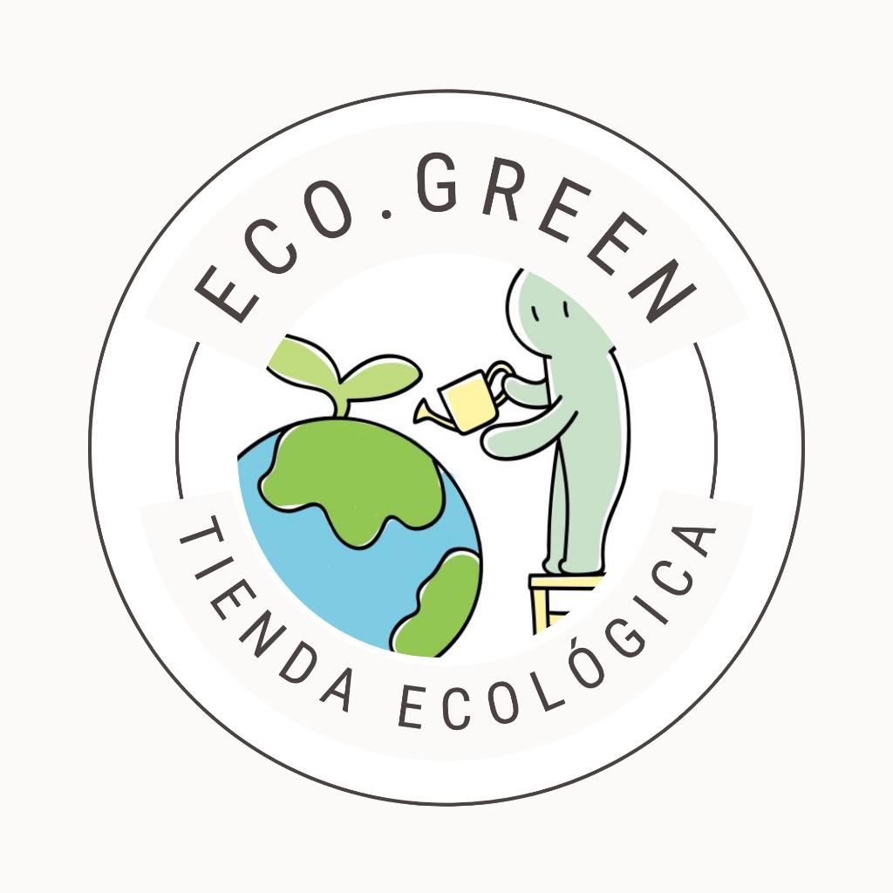

# 🌿 EcoMarket - Tienda Web Sostenible

<p align="center">
  
</p>

<p align="center">
  <strong>Una plataforma web moderna dedicada a promover el consumo consciente y responsable.</strong>
</p>

<p align="center">
  
  
  
  
</p>

---

## 📝 Descripción del Proyecto

**EcoMarket** (también representado como **Eco.Green** en la interfaz) es una tienda online de productos ecológicos, reutilizables y sustentables. El sitio web está diseñado con un enfoque moderno y limpio, buscando inspirar a los usuarios a adoptar un estilo de vida más amigable con el medio ambiente a través de alternativas sostenibles para su día a día.

El desarrollo destaca por el uso de estándares web modernos, estructuración semántica y un diseño totalmente responsivo sin el uso de frameworks pesados, garantizando velocidad y accesibilidad.

---

## 👥 Integrante del Equipo

*   **Sofia Salazar Hernandez**


---

## 🛠️ Tecnologías Utilizadas

El proyecto fue construido utilizando únicamente tecnologías web nativas para asegurar un código limpio, eficiente y fácil de mantener:

| Tecnología / Concepto | Descripción | Beneficio en el Proyecto |
| :--- | :--- | :--- |
| **HTML5 Semántico** | Uso de etiquetas estructurales (`<header>`, `<nav>`, `<section>`, `<article>`, `<footer>`). | Proporciona una estructura web clara, accesible y optimizada para SEO. |
| **CSS3 Puro** | Estilos CSS nativos escritos desde cero. | Mantiene los estilos limpios, ligeros y personalizados sin depender de preprocesadores o frameworks externos. |
| **Flexbox** | Modelo de caja flexible para alineación unidimensional. | Facilita la distribución flexible y dinámica de los elementos en menús, botones y componentes. |
| **CSS Grid** | Sistema de diseño bidimensional mediante cuadrículas. | Permite crear diseños de cuadrícula complejos, alineados y robustos (como la sección de productos y testimonios). |

---

## 📂 Estructura del Proyecto

A continuación, se detalla la organización de los archivos del proyecto:

```text
proyecto-final-HTML-y-CSS/
├── css/                  # Estilos CSS por página
│   ├── styles.css        # Estilos principales (Inicio)
│   ├── catalogo.css      # Estilos de la página de catálogo
│   ├── nosotros.css      # Estilos de la página de historia/testimonios
│   └── contacto.css      # Estilos de la página de contacto
├── img/                  # Recursos gráficos e imágenes locales
│   ├── logo.png          # Logo oficial de EcoMarket
│   └── [demás imágenes]  # Imágenes de productos y diseño
├── index.html            # Página de Inicio (Home)
├── catalogo.html         # Página de productos disponibles
├── nosotros.html         # Historia, principios y opiniones de clientes
├── contacto.html         # Formulario de contacto y datos de la empresa
└── README.md             # Documentación del proyecto (este archivo)
```

---

## 🖥️ Páginas y Secciones del Sitio

El sitio web se compone de 4 páginas principales totalmente conectadas:

1.  **Inicio (`index.html`)**: Presentación principal de la marca con un banner Hero llamativo ("Compra Verde, Vive Sostenible") y una sección de **Productos Destacados** organizada en Grid.
2.  **Catálogo (`catalogo.html`)**: Muestra la variedad completa de productos ecológicos disponibles en la tienda con sus precios, descripciones y botones de acción.
3.  **Nosotros (`nosotros.html`)**: Describe la historia de EcoMarket, sus tres principios clave (Sin Plástico, Comercio Justo, Consumo Responsable) y testimonios reales de clientes satisfechos.
4.  **Contacto (`contacto.html`)**: Incluye un formulario interactivo validado para que los usuarios puedan enviar mensajes, además de enlaces a redes sociales y datos de contacto de la tienda.

---

## 🚀 Cómo Ejecutar el Proyecto

Dado que el proyecto utiliza tecnologías web nativas (HTML y CSS puro), no requiere de ningún proceso de compilación o instalación compleja:

1.  **Descarga o clona** este repositorio en tu computadora.
2.  Navega a la carpeta principal del proyecto.
3.  Haz doble clic en el archivo [index.html](file:///c:/Users/Usuario/Desktop/Trabajo-Sofi/proyecto-final-HTML-y-CSS/index.html) para abrir el sitio web directamente en cualquier navegador moderno (Google Chrome, Firefox, Microsoft Edge, Safari, etc.).
4.  *(Opcional)* Si utilizas **Visual Studio Code**, puedes usar la extensión **Live Server** para abrir el proyecto en un servidor local interactivo que se actualice automáticamente con cada cambio.
